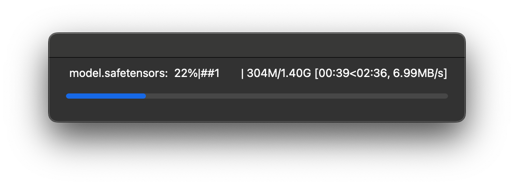

# Snap2LaTeX

Snap2LaTeX is a tool that converts a picture of a mathematical equation into a LaTeX code. It uses https://github.com/NormXU/nougat-latex-ocr to recognize the equation and convert it into LaTeX code.

Compared to LaTeX-OCR, Snap2LaTeX is a standalone application that does not require any install. It has a simpler interface and uses MPS by default.

# Usage

Download from [releases](https://github.com/ProfFan/Snap2LaTeX/releases).

Run the application.

The application will start downloading the model. It will take a few minutes.



There will be an icon in the system tray.


Click on it and select "Capture" to capture a screenshot of the equation. The application will then recognize the equation and display the LaTeX code. When the processing is in progress, the icon will turn yellow.

| Capture | LaTeX |
| --- | --- |
|  |  |

**Double click on the LaTeX code and right click to copy.**

| Matrix | Code |
| --- | --- |
|  |  |

# Build

```bash
pip install -U https://github.com/huggingface/transformers/archive/refs/heads/main.zip
pip install --pre torch torchvision torchaudio --extra-index-url https://download.pytorch.org/whl/nightly/cpu -U
pip install -r requirements.txt
cd standalone_app
pyinstaller Snap2LaTeX.spec
```

# Alternatives

- [Mathpix](https://mathpix.com/): Paid service.
- [LaTeX-OCR](https://github.com/lukas-blecher/LaTeX-OCR): Free and Open Source. Slightly more verbose interface.

# LICENSE

```
Copyright 2024 Fan Jiang
Copyright 2024 NormXU

Apache License 2.0
```
